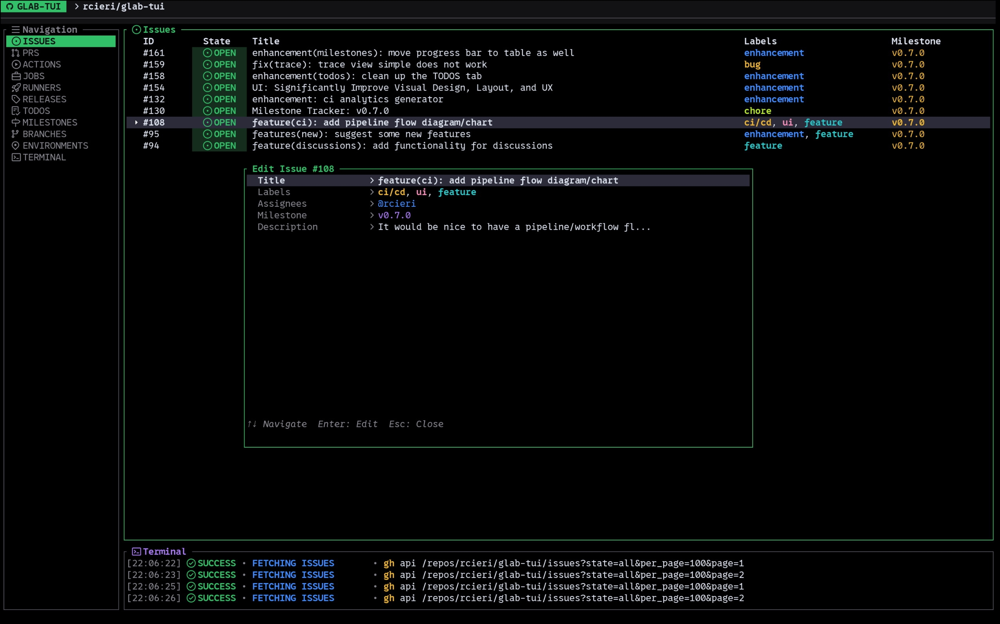

# glab-tui

A terminal user interface (TUI) for GitLab and GitHub, built on top of [`glab`](https://gitlab.com/gitlab-org/cli) and [`gh`](https://cli.github.com/). Browse issues, pull requests / merge requests, pipelines, runners, and releases without leaving your terminal.

---

## Features

- **GitHub & GitLab Dual Support** — Automatic detection of repository host, dynamically translating TUI actions and metadata updates to `gh` or `glab` CLI commands.
- **Issues** — list, filter, create, and edit issues (title, labels, assignees, milestone, due date, weight, confidentiality, description)
- **Merge Requests / Pull Requests** — list, filter, create MRs from issues, approve, merge, view diffs in terminal with code reviews, and edit MR/PR metadata
- **Code Reviews** — draft inline comments, multi-line selections, code suggestions with syntax highlighting, and atomic review submission
- **Side-by-Side Diff** — toggle between unified and side-by-side diff layouts with syntax highlighting
- **Pipelines / Actions** — inspect pipelines and their jobs, retry/cancel pipelines/actions and individual jobs, stream build traces
- **Runners** — list runners with structured details panel; pause/resume, edit descriptions, and monitor live performance/queue metrics
- **Releases** — browse project releases and view details in the terminal
- **Multi-colored Labels** — table columns render labels with their individual unique hashed colors, preserving search highlights
- **Columns Config Modal** — press `Tab` / `,` to open a centered popup overlay to toggle column visibility, group by any column, and set sort order
- **Value-based Column Filtering** — filter table rows by specific column values from the configure popup
- **Live Search** — fuzzy-filter across all visible columns by pressing `/`
- **Inline editing** — full edit menus with searchable multi-select selectors for labels, assignees, reviewers, and milestones
- **Interactive Date Picker** — calendar widget for Due Date / Start Date fields in edit menus
- **External editor** — descriptions and freeform fields open in your `$EDITOR` / `$VISUAL` (also via `Ctrl+E`)
- **Lazy-load tabs** — data for each tab is only fetched the first time you switch to it; refresh with `F5` / `Ctrl+R`
- **Themes** — six built-in color themes; fully customizable via `config.toml` or custom `.toml` files
- **Configurable keybindings** — every action is remappable in `~/.config/glab-tui/config.toml`

---



## Prerequisites

| Requirement | Notes |
|---|---|
| **Rust** (stable, edition 2024) | Install via [rustup](https://rustup.rs/) |
| **[`glab`](https://gitlab.com/gitlab-org/cli)** | Must be on `$PATH` and authenticated (`glab auth login`) |
| **`git`** | Used to auto-detect the current project from `git remote get-url origin` |
| **A terminal emulator** | Any terminal that supports 256 colours and Unicode |

> **Windows note:** the binary works on Windows. Editor integration uses `cmd /c` automatically when `$OS` is Windows.

---

## Installation

### From source

```sh
git clone https://github.com/rcieri/glab-tui
cd glab-tui
cargo build --release
# The binary is at ./target/release/glab-tui
```

Copy the binary somewhere on your `$PATH`, e.g.:

```sh
cp target/release/glab-tui ~/.local/bin/
```

### With `cargo install` (from the repo root)

```sh
cargo install --path .
```

### Install script (Linux / macOS)

```sh
curl -sSfL https://raw.githubusercontent.com/rcieri/glab-tui/main/install.sh | sh
```

Or with `wget`:

```sh
wget -qO- https://raw.githubusercontent.com/rcieri/glab-tui/main/install.sh | sh
```

The binary is installed to `~/.local/bin/` (configurable via `PREFIX` environment variable).

### Install script (Windows)

```powershell
iwr -useb https://raw.githubusercontent.com/rcieri/glab-tui/main/install.ps1 | iex
```

The binary is installed to `$env:USERPROFILE\.local\bin\` (configurable via `-Prefix` parameter).

---

## Configuration

### Authentication

`glab-tui` delegates all API calls to the `glab` and `gh` CLIs — authenticate once and you're done:

```sh
glab auth login   # for GitLab repos
gh auth login     # for GitHub repos
```

The active project is detected automatically from the `origin` remote in the current working directory.

### Config file

On first launch, `glab-tui` writes a default config to:

```
~/.config/glab-tui/config.toml          # Linux / macOS (XDG)
$GLAB_TUI_CONFIG                         # override: set to the full file path
```

The generated file is fully annotated. Key sections:

```toml
# Pick a built-in theme preset
theme_preset = "default"   # default | tokyo-night | gruvbox | nord | catppuccin-mocha | dracula

# Override individual colors (takes precedence over theme_preset)
# [theme]
# bg = "#121214"
# border_focused = "#31bf67"
# ...19 color tokens total

# Remap any keybinding
[keybindings.global]
next_tab = "l"
# ...

[keybindings.issues]
create_issue = "n"
edit_entity = "e"
# ...

# Persist default column visibility / grouping per pane
# [issues]
# columns = ["ID", "State", "Title", "Labels"]
# group_by_column = "State"
```

### Custom themes

Drop any `<name>.toml` file into `~/.config/glab-tui/themes/` and set `theme_preset = "<name>"` in `config.toml`. The file must define the same 19 color tokens as the bundled themes.

### Editor

Set `$EDITOR` or `$VISUAL` to control which editor opens for description and freeform fields:

```sh
export EDITOR=nvim   # or vim, nano, hx, code, etc.
```

The default fallback is `helix` (`hx`). Inside any edit menu you can also press `Ctrl+E` to open the editor directly.

---

## Usage

```sh
# Run from inside a GitLab or GitHub repository:
cd /path/to/your/repo
glab-tui

# Specifying optional flags:
glab-tui --repo organization/project-name
glab-tui --dir /path/to/other/repo
```

### Options

| Flag | Argument | Description |
|---|---|---|
| `--repo` | `owner/repo` | Launch glab-tui for a custom remote repository |
| `--dir` | `/path/to/dir` | Launch glab-tui in a custom repository directory |
| `-h`, `--help` | | Print usage help details |

The TUI will launch in the terminal, auto-detecting the project context and fetching the Issues tab immediately.

---

## Key Bindings

### Global

> All keys below are the defaults. Every binding is remappable in `config.toml` under `[keybindings.global]`.

| Key | Action |
|---|---|
| `l` / `→` | Next tab |
| `h` / `←` | Previous tab |
| `Tab` / `,` | Toggle column configure popup (columns, group, order) |
| `Esc` | Close configure popup / overlay |
| `j` / `↓` | Move selection down |
| `k` / `↑` | Move selection up |
| `J` | Scroll description panel down |
| `K` | Scroll description panel up |
| `f` / `/` | Open search / filter bar |
| `Enter` / `Esc` (in search) | Close search bar |
| `?` | Show help |
| `F5` / `Ctrl+R` | Refresh current tab |
| `q` / `Esc` | Quit (or close current overlay) |

---

### Issues tab

| Key | Action |
|---|---|
| `n` | Create new issue (prompts for title) |
| `e` | Open edit menu for selected issue |
| `c` | Close selected issue |
| `r` | Reopen selected issue |
| `J` | Scroll description panel down |
| `K` | Scroll description panel up |

**Issue edit menu fields**

| Field | Input method |
|---|---|
| Title | Inline text input |
| Labels | Searchable multi-select (fetched from GitLab/GitHub) |
| Assignees | Searchable multi-select (fetched from project members) |
| Milestone | Searchable single-select (fetched from project) |
| Confidential | Single-select: Public / Confidential *(GitLab only)* |
| Due Date | Interactive calendar date picker (`Enter` to open; `h`/`l` month, `j`/`k` day) *(GitLab only)* |
| Weight | Inline text input (integer) *(GitLab only)* |
| Description | Opens `$EDITOR` (or press `Ctrl+E`) |

---

### Merge Requests tab

| Key | Action |
|---|---|
| `n` | Create MR from issue ID (prompts for issue IID) |
| `e` | Open edit menu for selected MR |
| `a` | Approve selected MR |
| `m` | Merge selected MR (squash + remove source branch) |
| `v` | View diff of selected MR in terminal |
| `o` | Open selected MR in browser |
| `s` | Toggle Draft / Ready status |
| `c` | Close selected MR |
| `r` | Reopen selected MR |
| `J` | Scroll description panel down |
| `K` | Scroll description panel up |
| `d` | Toggle unified/side-by-side diff layout (inside diff view) |
| `c` | Add comment on selected line range (inside diff view) |
| `e` | Add code suggestion (inside diff view) |
| `a` | Open comment actions menu (inside diff view) |
| `r` | Submit pending review (inside diff view) |

**MR edit menu fields**

| Field | Input method |
|---|---|
| Title | Inline text input |
| Labels | Searchable multi-select |
| Assignees | Searchable multi-select |
| Reviewers | Searchable multi-select |
| Milestone | Searchable single-select |
| Target Branch | Inline text input |
| Status (Draft/Ready) | Single-select |
| Description | Opens `$EDITOR` (or press `Ctrl+E`) |

---

### Pipelines tab

| Key | Action |
|---|---|
| `Enter` | Drill into selected pipeline (show its jobs) |
| `Esc` / `Backspace` | Go back (jobs → pipelines, trace → jobs) |
| `p` | Trigger a new pipeline (`glab ci run --mr`) |
| `r` | Retry selected pipeline (or all checked pipelines) |
| `d` | Cancel selected pipeline |
| `o` | Open pipeline in browser |
| `Space` | Check/uncheck pipeline for bulk retry |
| `j` / `↓` | (in job view) move down |
| `k` / `↑` | (in job view) move up |

**Inside a pipeline (job view)**

| Key | Action |
|---|---|
| `Enter` | Fetch and display job trace |
| `r` | Retry selected job (or all checked jobs) |
| `d` | Download job artifact |
| `o` | Open job in browser |
| `e` | Open job trace in `$EDITOR` |
| `Space` | Check/uncheck job for bulk retry |
| `j` / `↓` | (in trace view) scroll down |
| `k` / `↑` | (in trace view) scroll up |

---

### Runners tab

| Key | Action |
|---|---|
| `p` | Pause selected runner |
| `r` | Resume (un-pause) selected runner |
| `e` | Edit runner description (inline text input) |

---

### Releases tab

| Key | Action |
|---|---|
| `Enter` | View release details in terminal |
| `o` | Open release in browser |

---

### Selector overlays (labels, assignees, etc.)

| Key | Action |
|---|---|
| `j` / `↓` | Move down |
| `k` / `↑` | Move up |
| `Space` | Toggle selection |
| `f` / `/` / `i` | Enter filter/search mode |
| `Backspace` | Delete last character in filter |
| `Enter` | Confirm selection and apply |
| `Esc` | Cancel and return to edit menu |

> If you type a value that doesn't exist in the list, a **`+ Create "…"`** option appears at the top, letting you create a new label inline.

---

## Dependencies

| Crate | Version | Purpose |
|---|---|---|
| [`ratatui`](https://crates.io/crates/ratatui) | 0.30.2 | TUI rendering framework |
| [`crossterm`](https://crates.io/crates/crossterm) | 0.29.0 | Cross-platform terminal I/O and event streaming |
| [`tokio`](https://crates.io/crates/tokio) | 1.38 (full) | Async runtime for concurrent data fetching |
| [`serde`](https://crates.io/crates/serde) | 1.0 (derive) | Serialization / deserialization |
| [`serde_json`](https://crates.io/crates/serde_json) | 1.0 | Parsing JSON responses from `glab api` |
| [`toml`](https://crates.io/crates/toml) | 0.8 | Parsing `config.toml` and theme files |
| [`anyhow`](https://crates.io/crates/anyhow) | 1.0 | Ergonomic error handling |
| [`chrono`](https://crates.io/crates/chrono) | 0.4 | Timestamp formatting ("2 hours ago") |
| [`tempfile`](https://crates.io/crates/tempfile) | 3.10 | Temporary files for editor integration |
| [`fuzzy-matcher`](https://crates.io/crates/fuzzy-matcher) | 0.3 | Fuzzy search/filter across table columns |
| [`syntect`](https://crates.io/crates/syntect) | 5 | Syntax highlighting in diff and preview panes |

All API calls are made by shelling out to `gh api` or `glab api` — no personal access token or direct HTTP client is required inside the binary.

---

## Project Structure

```
src/
├── main.rs          # Entry point, event loop, all key-binding handlers
├── app.rs           # App state, Tab enum, DiffView, DatePicker, filtering logic
├── config.rs        # Config/Theme loading, keybinding structs, TOML generation
├── event.rs         # Async event handler (keyboard, tick, async data events)
├── ui.rs            # Ratatui render functions for every tab and overlay
├── themes/          # Bundled theme TOML files (default, tokyo-night, gruvbox, nord, catppuccin-mocha, dracula)
├── gitlab/
│   ├── mod.rs       # Module declarations
│   ├── client.rs    # GitlabClient (wraps `gh api` / `glab api`), endpoint translation
│   ├── issues.rs    # Issue type + list/get/edit API calls
│   ├── mr.rs        # MergeRequest/PR type + list/get/edit API calls
│   ├── pipelines.rs # Pipeline + Job types, list/fetch/retry logic, unit tests
│   ├── runners.rs   # Runner type + list/edit API calls
│   ├── releases.rs  # Release type + list API call
│   ├── milestones.rs# Milestone type + list/issue API calls
│   └── notifications.rs # Todo/notification type + list API calls
└── utils/
    ├── mod.rs       # Module declarations
    ├── cache.rs     # Offline caching for repo context and API payloads
    ├── format.rs    # Time formatting, markdown rendering, string truncation
    ├── ui.rs        # StatefulTable generic helper
    └── update.rs    # GitHub releases self-updater
```

---

## Running Tests

```sh
cargo test
```

Unit tests live in several modules:
- [`src/gitlab/pipelines.rs`](src/gitlab/pipelines.rs) — pipeline job deduplication and stage-ordering logic.
- [`src/gitlab/client.rs`](src/gitlab/client.rs) — GitHub-to-GitLab endpoint translation and JSON schema translation.
- [`src/app.rs`](src/app.rs) — selector fuzzy-matching and filter logic.

---

## Contributing

1. Fork the repo and create a feature branch.
2. Keep commits atomic and follow [Conventional Commits](https://www.conventionalcommits.org/).
3. Run `cargo fmt` and `cargo clippy -- -D warnings` before opening a PR.
4. Add or update tests where relevant.

---

## License

MIT — see [LICENSE](LICENSE) if present, or treat as unlicensed until one is added.
